

  <table border="1">
    <tr>
      <td align="center" style="padding: 20px;">
        <h3>📢 Domain & Email Migration Notice</h3>
        
Since <b>19 March 2026</b>, Carbonhub has transitioned to new domains as <code>carbonhub.app</code> was not renewed:

        
🌐 <b>Website:</b> <a href="https://carbonhub.faizath.com">carbonhub.faizath.com</a> (formerly <i>carbonhub.app</i>) 
        ⚙️ <b>API:</b> <a href="https://carbonhub-api.faizath.com">carbonhub-api.faizath.com</a> (formerly <i>api.carbonhub.app</i>) 
        📧 <b>Email:</b> <a href="mailto:contact@carbonhub.faizath.com">contact@carbonhub.faizath.com</a> (formerly <i>contact@carbonhub.app</i>) 
        🛰️ <b>CDN:</b> <a>carbonhub-cdn.faizath.com</a> (formerly <i>cdn.carbonhub.app</i>) 
        📈 <b>Status Pages:</b> <a href="https://status.faizath.com/status/carbonhub">https://status.faizath.com/status/carbonhub</a> (formerly <i>status.carbonhub.app</i>)
        

      </td>
    </tr>
  </table>

# CarbonHub

**Make Every Emission Count**

Track emissions, earn blockchain-powered rewards, and trade carbon credits — all in real time,
all in one intelligent platform.

[**Live app**](https://carbonhub.faizath.com) · [**API & docs**](https://carbonhub-api.faizath.com)

 

 

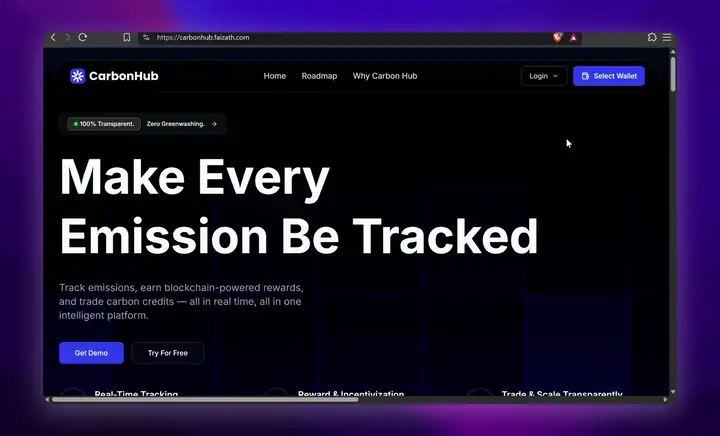

---

## What is CarbonHub?

**CarbonHub** turns a carbon allowance into something you can actually hold and trade. You connect
a Solana wallet, sign a one-time challenge to prove you own it — there is no password anywhere —
and land on a dashboard showing your carbon credit balance beside the emission quota you have left
for the year. From there you either **withdraw quota** into spendable credits, or take them to the
trading desk and swap between **ECFCH** (the carbon credit token) and **EURCH** (its euro-denominated
counterpart) at a rate tracking the live carbon futures price. Every order is a real SPL token
transfer you approve in your own wallet, and it settles **signed → transferred → minted** before the
confirmation returns.

Companies register the same way and receive an API key scoped to them alone. That key is what an
ESP32 sensor node in the field uses to push CO₂ readings to the platform: the device filters its own
MQ135 readings, scores them against a locally trained model, and reports normal samples and
anomalies to separate endpoints. Emissions therefore arrive from hardware rather than from a form,
and the quota shown on the dashboard is drawn down by what was actually measured.

### Built for

CarbonHub was built by a five-person team for **Information Systems and Technology Engineering
(II3240-24)** at **STEI ITB**, as a working answer to how a carbon market stays auditable when the
usual answer is a spreadsheet. It is deployed and running: the web app on Cloudflare Pages, the API
on CapRover, and the token contracts on Solana.

### Highlights

- **Passwordless by design** — authentication is a `tweetnacl` signature check against a Solana
  public key, so the platform never stores a credential that could leak. Device ingest uses a
  separate per-company `x-api-key`, which cannot be swapped for a user session.
- **Swaps are settled from the signed transfer, not the request** — `/swap/execute` decodes the
  transaction it was handed, finds the SPL transfer instruction, and mints against the amount and
  destination actually signed. Naming a different token or a larger figure in the request body
  changes nothing.
- **Replay-safe payouts** — a unique index on the transaction signature claims each swap before any
  token is minted, so two requests carrying the same signed transaction settle exactly once.
- **Confirmation that survives the round trip** — a wallet-signed transaction loses its blockhash
  lifetime in the wire format, so execution confirms by polling the signature itself rather than
  dereferencing a lifetime that decoding cannot restore.
- **Anomaly detection at the edge** — the ESP32 node runs a moving-average filter and z-score
  scoring against a scikit-learn model on-device, so a faulty reading is flagged where it is taken
  instead of after it has entered the ledger.
- **Prices from a live market** — the exchange rate is read from a real carbon futures quote and
  cached, with the trading desk charting the same instrument through TradingView.

---

## Screenshots

<table>
<tr>
<td width="50%" align="center"><b>Choosing a wallet</b>  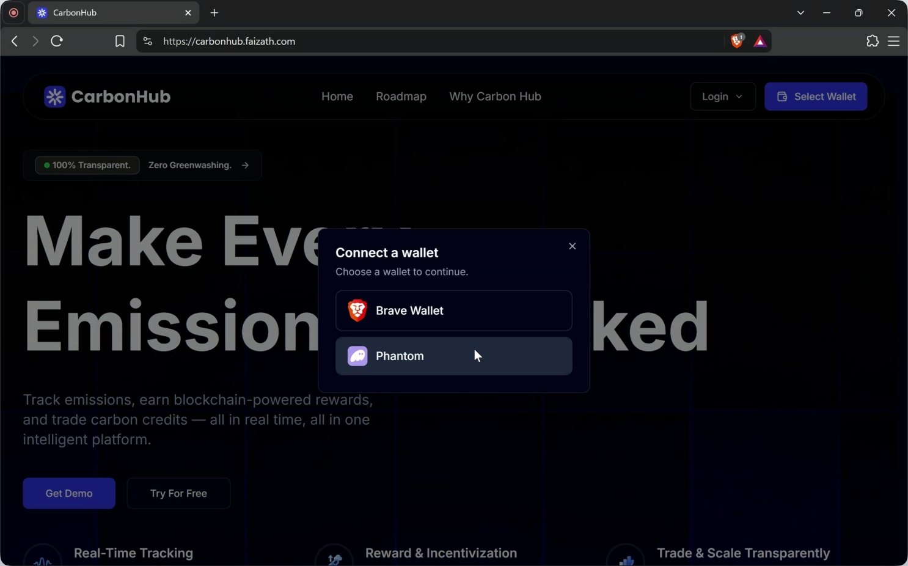</td>
<td width="50%" align="center"><b>Phantom — connection request</b>  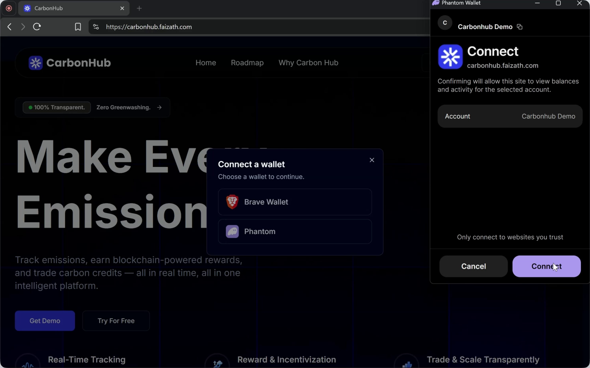</td>
</tr>
<tr>
<td width="50%" align="center"><b>User or company login</b>  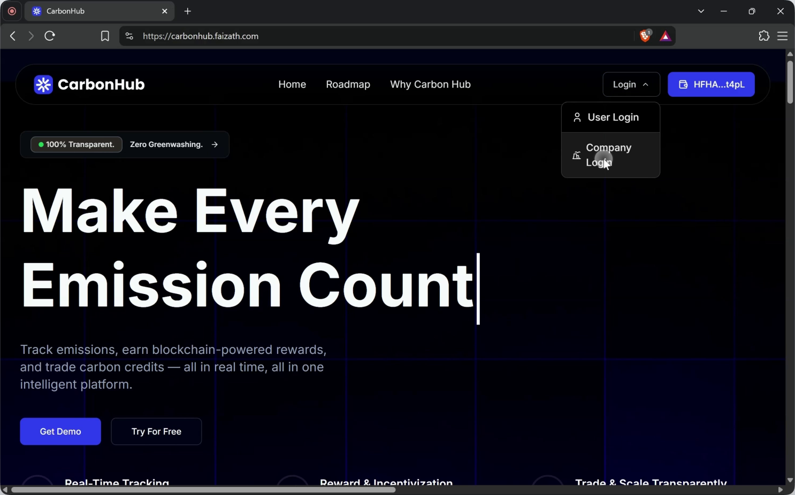</td>
<td width="50%" align="center"><b>Phantom — signing the auth challenge</b>  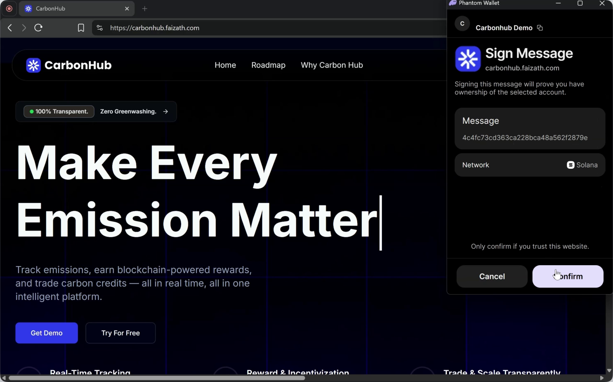</td>
</tr>
<tr>
<td width="50%" align="center"><b>Dashboard — credits and quota</b>  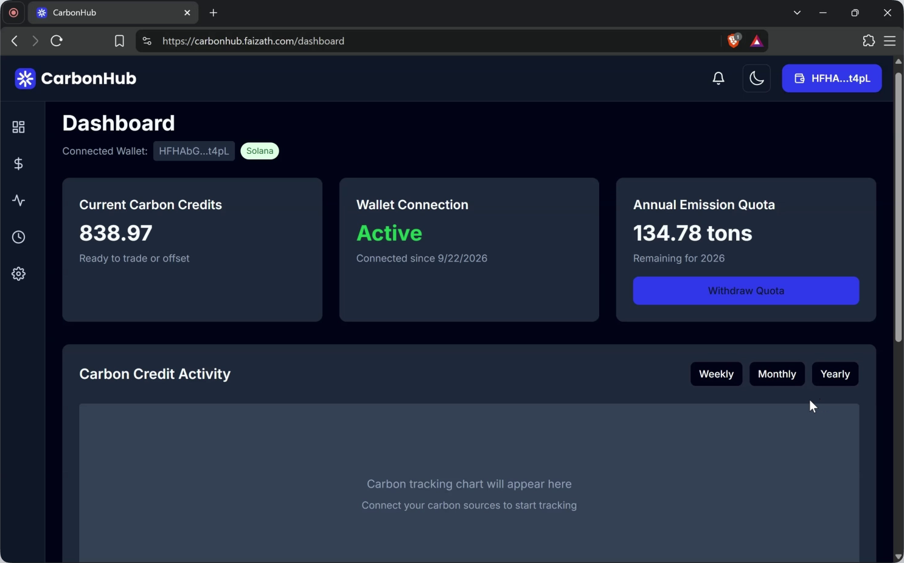</td>
<td width="50%" align="center"><b>Withdrawing emission quota</b>  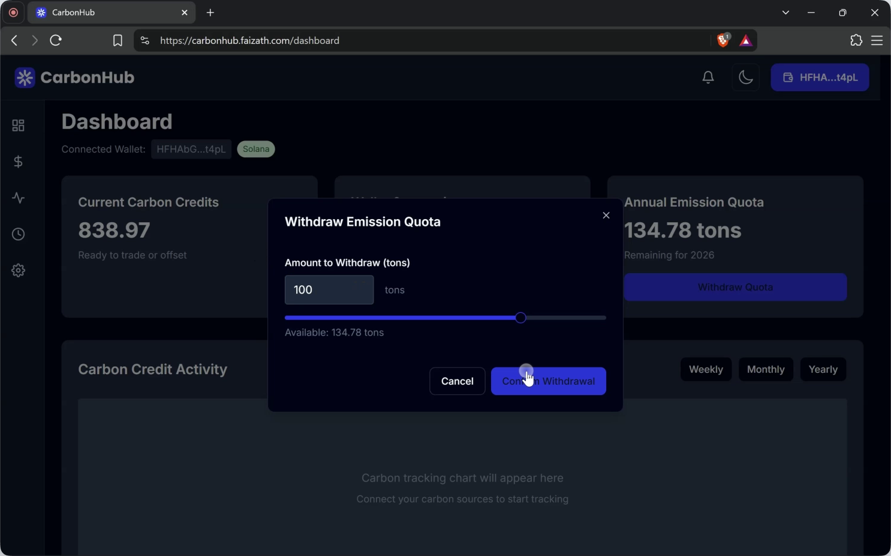</td>
</tr>
<tr>
<td width="50%" align="center"><b>Trading desk — placing an order</b>  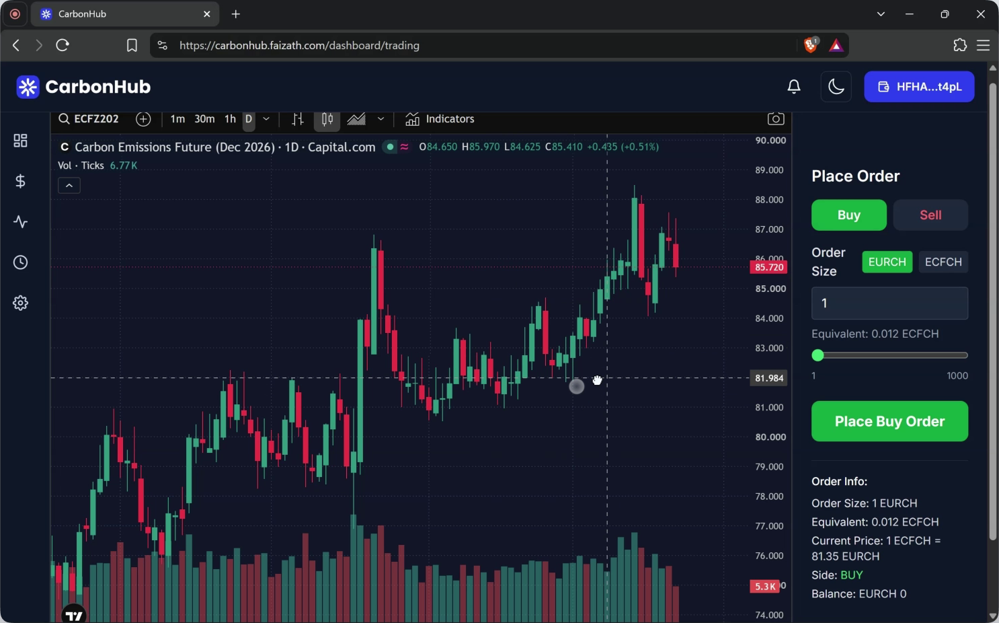</td>
<td width="50%" align="center"><b>Phantom — confirming the swap</b>  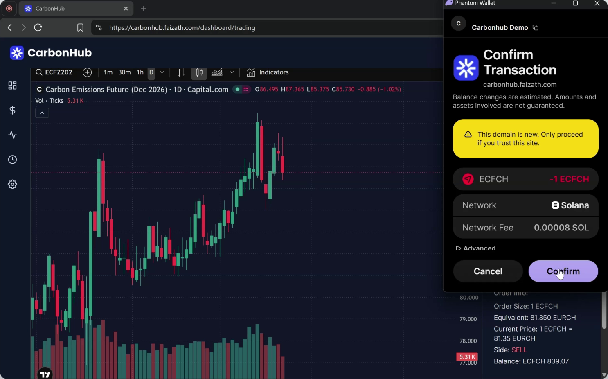</td>
</tr>
<tr>
<td width="50%" align="center"><b>Order filled, signature returned</b>  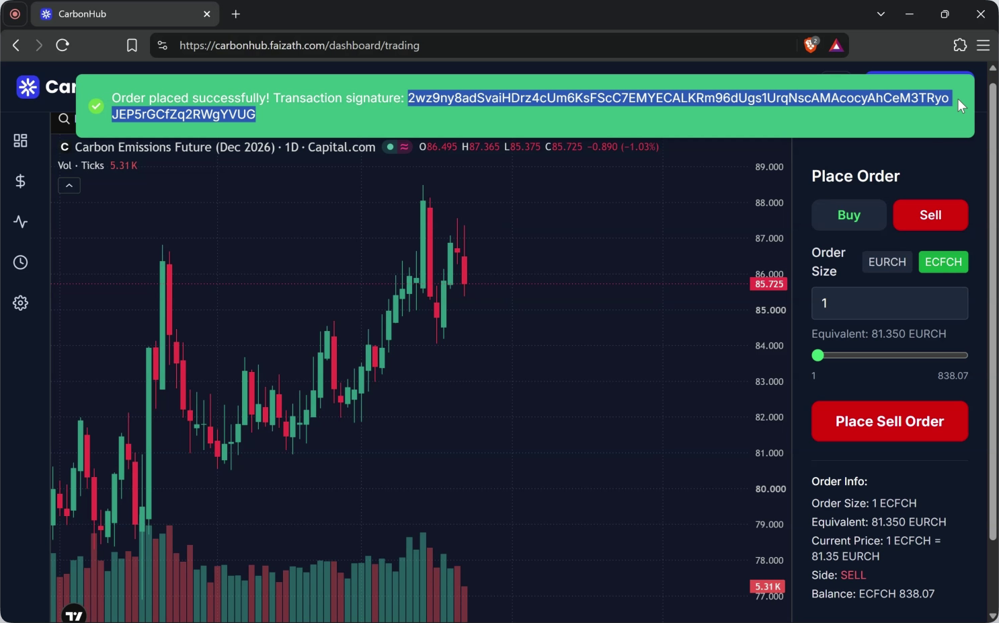</td>
<td width="50%" align="center"><b>Minted balances in the wallet</b>  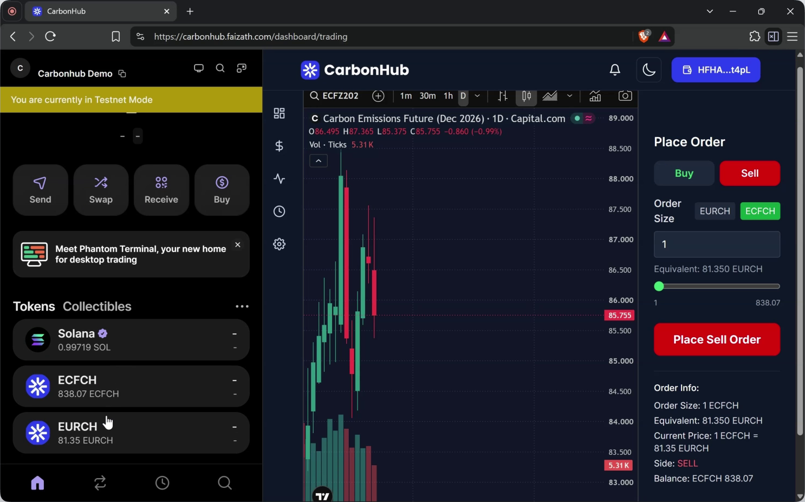</td>
</tr>
</table>

---

## The team behind CarbonHub

<table>
<tr>
<td align="center" width="20%">
 
<b>Jihan Aurelia</b> 
<i>Frontend Developer</i>  
<a href="https://github.com/jijiau">GitHub</a> · <a href="https://www.linkedin.com/in/jihanaurelia/">LinkedIn</a>
</td>
<td align="center" width="20%">
 
<b>Serenada Cinta</b> 
<i>UI/UX Designer</i>  
<a href="https://github.com/Serenadacinta">GitHub</a> · <a href="https://www.linkedin.com/in/serenada-cinta-sunindyo-77aa55283/">LinkedIn</a>
</td>
<td align="center" width="20%">
 
<b>Aththariq Lisan</b> 
<i>Frontend Developer</i>  
<a href="https://github.com/aththariq">GitHub</a> · <a href="https://www.linkedin.com/in/aththariqlisan/">LinkedIn</a>
</td>
<td align="center" width="20%">
 
<b>Nasywaa Anggun</b> 
<i>Backend Developer</i>  
<a href="https://github.com/nasywaanaa">GitHub</a> · <a href="https://www.linkedin.com/in/nasywaa-anggun-athiefah/">LinkedIn</a>
</td>
<td align="center" width="20%">
 
<b>Faiz Atharrahman</b> 
<i>Backend Developer</i>  
<a href="https://github.com/faizath">GitHub</a> · <a href="https://www.linkedin.com/in/faizath/">LinkedIn</a>
</td>
</tr>
</table>

---

## Repositories

| Repository | Description | Tech stack | Live |
|---|---|---|---|
| [**carbonhub-web**](https://github.com/carbonhub-app/carbonhub-web) | Next.js 16 statically exported single-page app — the landing site, wallet login, dashboard and trading desk. | Next.js · React 19 · TypeScript · Tailwind CSS · Lightweight Charts | [carbonhub.faizath.com](https://carbonhub.faizath.com) |
| [**carbonhub-api**](https://github.com/carbonhub-app/carbonhub-api) | Bun + Elysia REST API — wallet-signature auth, emission collection and ECFCH/EURCH token swaps on Solana. | Bun · Elysia · MongoDB · Solana Kit · SPL Token | [carbonhub-api.faizath.com](https://carbonhub-api.faizath.com) |
| [**carbonhub-aiot**](https://github.com/carbonhub-app/carbonhub-aiot) | ESP32 firmware and a Python companion — samples CO₂ on an MQ135, scores anomalies locally and reports both to the API. | ESP32 · MQ135 · Python · scikit-learn · NumPy | — |
| [**carbonhub-mobile**](https://github.com/carbonhub-app/carbonhub-mobile) | Expo / React Native client — a cross-platform interface for tracking a carbon footprint on the move. | Expo · React Native · Gluestack UI · NativeWind · Expo Router | — |
| [**.github**](https://github.com/carbonhub-app/.github) | This organization profile and its assets. | Markdown | — |

> [!NOTE]
> The deployed platform runs against the Solana **devnet**. ECFCH and EURCH are test-network SPL
> tokens, so balances and swaps carry no real-world value.

---

Built at <b>STEI ITB</b> for <b>Information Systems and Technology Engineering (II3240-24)</b>.

